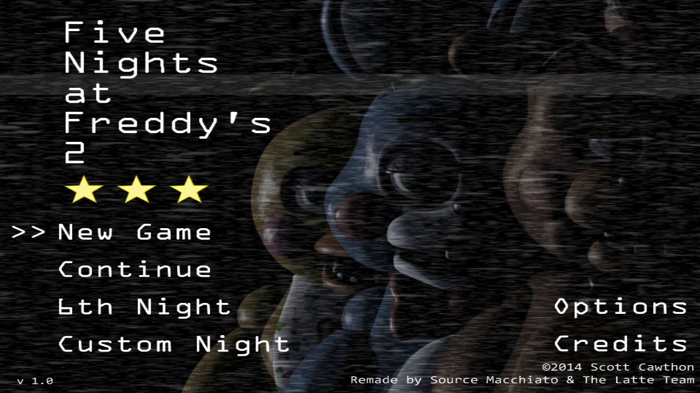
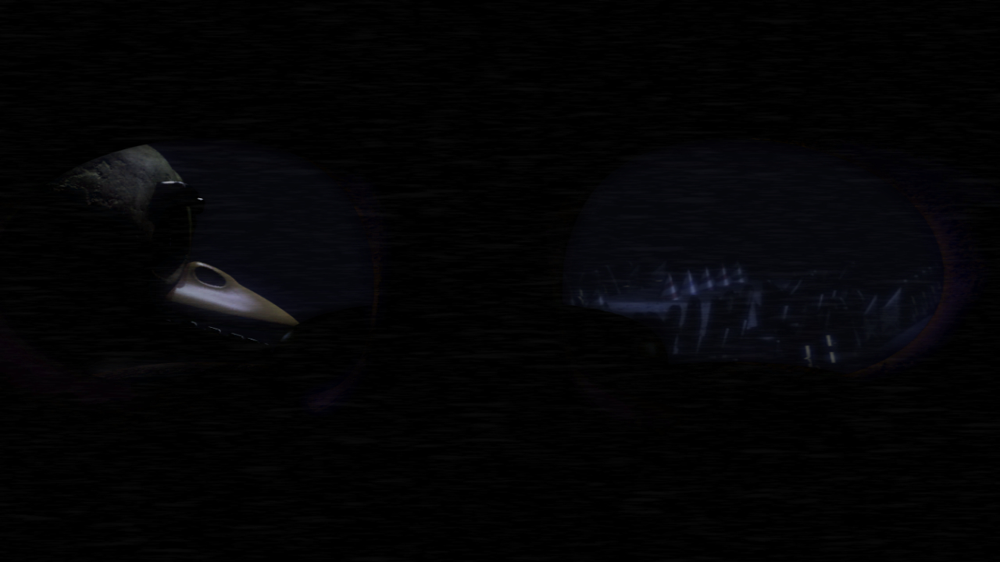
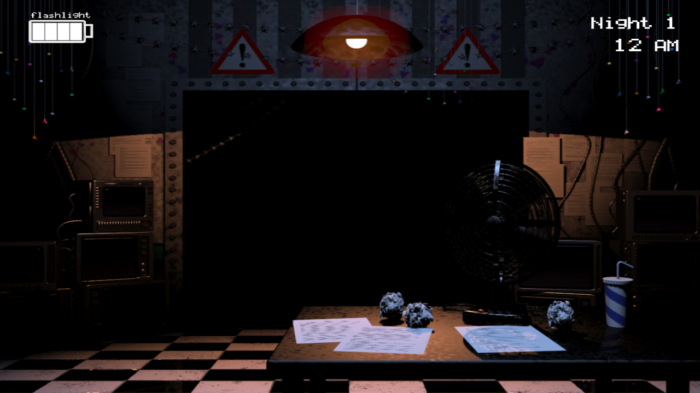
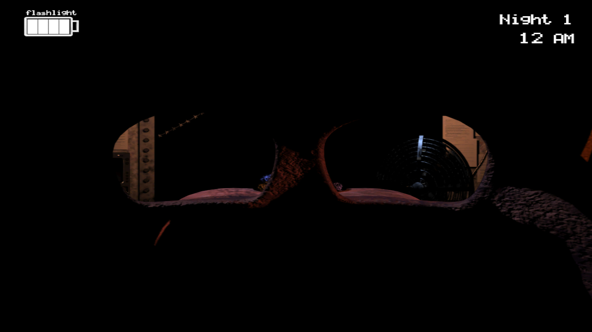
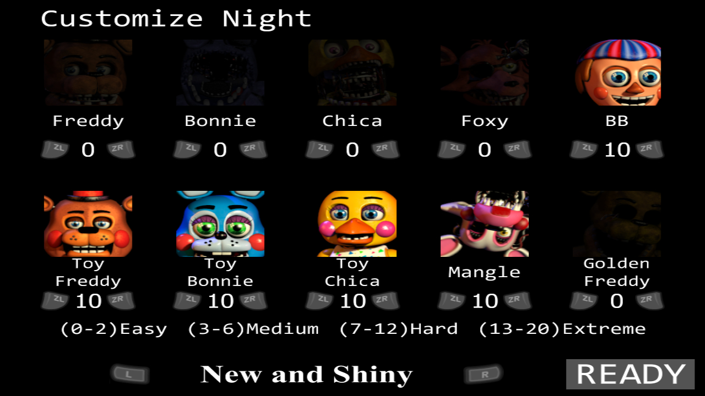

# FNaF 2: Wii U Edition

**A homebrew recreation of Five Nights at Freddy's 2 for the Wii U.**  
## About
FNaF 2: Wii U Edition is a fan-made homebrew port of *Five Nights at Freddy's 2*, developed from the base of Dimolade 3DS port, then recoded and adapted for the Wii U. This project aims to faithfully recreate the experience of the original game while optimizing it for Nintendo's console.

## Features
- Fully playable nights with AI behavior
- Custom Night
- Layout system
- Translations

### Controllers supported :
- GamePad
- Pro
- Classic
- Classic Pro
- Wiimote (+ Nunchuk)

## Installation
### Requirements
- A homebrewed Wii U (Haxchi, Mocha, Tiramisu or Aroma)
- NUSpli or WUP Installer GX2
- SD card with sufficient space

### Steps
1. Download the latest release from the [itch.io official page](https://the-latte-macchiato.itch.io/fnaf2-wiiu-edition).
2. Put the unzipped folder in the "install" folder of your SD card
3. Start the installation with WUP Installer GX2 or NUSspli (don't forget to put the [Sigpatches module](https://github.com/marco-calautti/SigpatchesModuleWiiU) in SD:/wiiu/environments/your-environment/modules/setup).
4. Go back to the Wii U menu, the game should appear. if you have any issue [join our discord server](https://discord.com/invite/Swybxyc3kU)

## Controls
| Action                  | Controls                          |
|-------------------------|----------------------------------|
| Move in office         | D-pad, left stick, Wiimote       |
| Toggle lights          | A                                |
| Toggle monitor         | L, 1 (Wiimote)                   |
| Toggle mask            | R, 2 (Wiimote)                   |
| Minimap navigation     | D-pad, left stick, touchscreen   |
| Wind up music box      | B, touchscreen                   |
| Mute call             | Minus                            |

## Images of the game
     

## Special thanks
Special thanks to Dimolade for giving his 3DS port of FNaF 2, and thanks to The Latte Team for contributing to this project.
## Contributing
If you’d like to contribute to this project, feel free to submit pull requests. Any bug reports or feature suggestions are welcome in the [Issues](https://github.com/Source-Macchiato/FNaF-2-WiiU-SC/issues) section.

## Disclaimer
This is a **fan project** and is in no way affiliated with Scott Cawthon or Steel Wool Studios. *Five Nights at Freddy's* is a trademark of its respective owners. This project is made for educational and entertainment purposes only.
